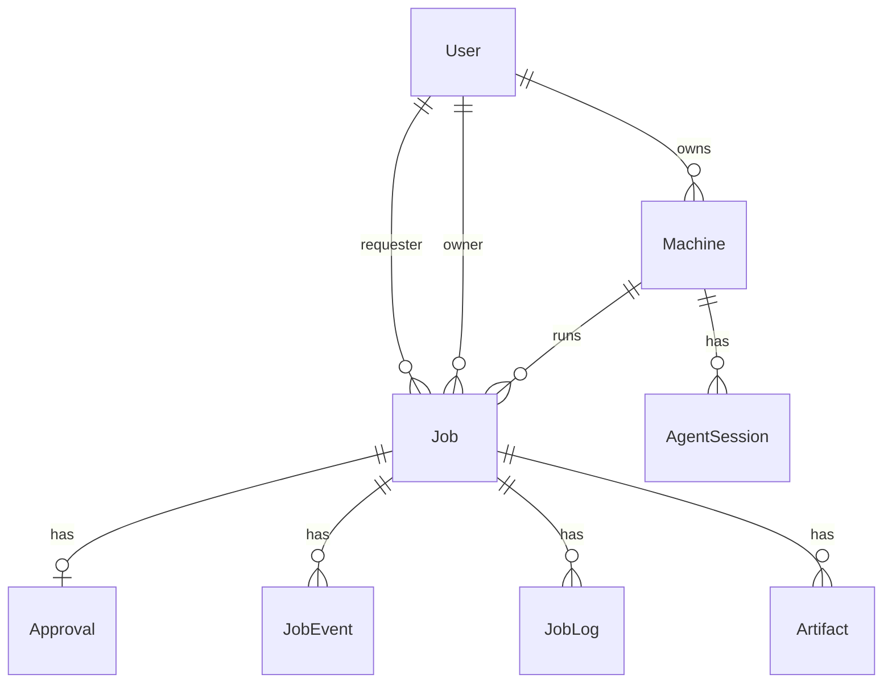

# Schema + APIs: notebook vs video, approvals, events, logs, artifacts, agent sessions

## Design choices (defaults for the hackathon)

| Topic                 | Recommendation                                                                                                                                                                                                                                                                                         |
| --------------------- | ------------------------------------------------------------------------------------------------------------------------------------------------------------------------------------------------------------------------------------------------------------------------------------------------------ |
| **Approval scope**    | **Global queue**: any `requester` submits; any user with `role === "owner"` (or `admin`) can list pending approvals and approve/reject. Later you can add `targetOwnerId` on `Job` if you need directed jobs.                                                                                          |
| **Approval entity**   | One `**Approval`** row per job (1:1), `status`: `pending`                                                                                                                                                                                                                                              |
| **Dual status**       | Keep `**Job.status`** as the canonical lifecycle (`pending_approval` → `approved` → …). On approve/reject, update **both** `Approval` and `Job`, and append `**JobEvent`** rows. Alternatively, derive UI from `Job.status` only and use `Approval` for audit—simplest is sync both and record events. |
| **Job type**          | Prisma `enum JobType { notebook video }`. Validation in API: **notebook** requires `notebookPath` (and optionally `command`); **video** requires `command` (FFmpeg).                                                                                                                                   |
| **Logs**              | `**JobLog`** rows: `jobId`, `line`, `sequence` (int, auto-increment per job or use `createdAt` + cursor), optional `stream` (`stdout`                                                                                                                                                                  |
| **Artifacts**         | `**Artifact`**: `jobId`, `name`, `storagePath` (or `storageKey` for S3), `mimeType`, `sizeBytes`, `createdAt`. Files live on disk until MinIO; API returns metadata + signed or static download URL later.                                                                                             |
| **Agent / heartbeat** | `**AgentSession`**: `machineId`, `token` (hashed or opaque id for agent auth), `status` (`active`                                                                                                                                                                                                      |

---

## Data model (Prisma)

**Enums to add**

- `JobType`: `notebook`, `video`
- `JobStatus` (string fields are error-prone): align with your README state machine, at least: `pending_approval`, `approved`, `rejected`, `queued`, `assigned`, `running`, `completed`, `failed`, `preempted`, `cancelled`, `draft` (optional)

`**Job` extensions** (extend [be/prisma/schema.prisma](be/prisma/schema.prisma))

- `type JobType`
- `notebookPath String?` (ML)
- `timeoutSeconds Int?` (default e.g. 3600)
- `updatedAt DateTime @updatedAt`
- Relations: `requester User @relation("JobRequester", …)`, `owner User? @relation("JobOwner", …)`, `machine Machine? @relation(fields: [machineId], references: [id])`
- Fix `User` model: replace single `jobs Job[]` with `jobsRequested Job[]` / `jobsOwned Job[]` (or equivalent names)

`**Approval`**

- `id`, `jobId` @unique, `status` (enum or string), `decidedById String?`, `decidedAt DateTime?`, `createdAt`
- Relation: `job Job`, `decidedBy User?`

`**JobEvent`**

- `id`, `jobId`, `type` (e.g. `status_changed`, `approval`, `agent_message`), `payload Json?`, `createdAt`
- Optional: `actorId String?` for user/agent

`**JobLog`**

- `id`, `jobId`, `sequence Int`, `line String`, `stream String?`, `createdAt`
- `@@unique([jobId, sequence])` or order by `createdAt` + `id`

`**Artifact**`

- `id`, `jobId`, `filename`, `storagePath`, `mimeType`, `sizeBytes`, `createdAt`

`**Machine**`

- `lastHeartbeatAt DateTime?`
- `jobs Job[]`, `sessions AgentSession[]`

`**AgentSession**`

- `id`, `machineId`, `token` (hashed with bcrypt or store random secret + hash), `lastHeartbeatAt`, `status`, `createdAt`
- Relation: `machine Machine`

**Migration note**: Existing `Job` rows need defaults for new required fields (`type` default `notebook` or backfill). Run `prisma migrate dev` after editing.

---

## API surface (Express)

Mount under existing `/api` prefix in [be/src/router/index.ts](be/src/router/index.ts).

| Method | Path                                 | Purpose                                                                                                          |
| ------ | ------------------------------------ | ---------------------------------------------------------------------------------------------------------------- |
| `GET`  | `/api/jobs`                          | List jobs for current user (requester: own; owner: optional filter by status)                                    |
| `POST` | `/api/jobs`                          | Create job (extend body: `type`, `notebookPath`, `timeoutSeconds`) + create `Approval` pending + `JobEvent`      |
| `GET`  | `/api/jobs/:id`                      | Job detail (include `approval`, `machine`, counts)                                                               |
| `POST` | `/api/jobs/:id/stop`                 | Cancel or request stop (`cancelled` / `preempted` per rules)                                                     |
| `GET`  | `/api/jobs/:id/logs`                 | Paginated logs (`?cursor=` / `?afterSequence=`)                                                                  |
| `POST` | `/api/jobs/:id/logs`                 | **Agent-only** (see auth below): append log lines                                                                |
| `GET`  | `/api/jobs/:id/artifacts`            | List artifacts                                                                                                   |
| `POST` | `/api/jobs/:id/artifacts`            | **Agent-only**: register artifact after upload                                                                   |
| `GET`  | `/api/approvals/pending`             | Owners: jobs awaiting approval (join `Job` + `Approval where pending`)                                           |
| `POST` | `/api/approvals/:approvalId/approve` | Owner approves → `Job` → `approved`, event                                                                       |
| `POST` | `/api/approvals/:approvalId/reject`  | Owner rejects → `rejected`, event                                                                                |
| `POST` | `/api/machines/:id/heartbeat`        | Agent: body `{ sessionToken }`, updates `AgentSession` + `Machine.lastHeartbeatAt`                               |
| `POST` | `/api/machines/:id/reclaim`          | Owner: mark jobs on this machine `preempted` or trigger stop, clear assignment (define minimal behavior for MVP) |

**Auth rules**

- **Requester**: CRUD own jobs, `GET` logs/artifacts for own jobs, `stop` own jobs.
- **Owner**: `GET` pending approvals, approve/reject, `reclaim` own machines, read jobs assigned to their machines (or global pending only—pick one and document).
- **Agent**: Heartbeat and append logs/artifacts must **not** use the browser session alone. MVP options: (1) **API key** per machine in `Machine` or `AgentSession` sent as `Authorization: Bearer`; (2) signed session token issued at agent registration. Plan for a minimal `**requireAgentAuth`** middleware that validates token against `AgentSession` + `machineId`.

---

## Implementation order

1. **Prisma**: enums, new models, relations, `User`/`Job` relation fix; migrate.
2. **Shared lib**: `src/lib/jobStatus.ts` (allowed transitions) + `appendJobEvent()` helper using Prisma.
3. **Jobs routes**: Extend `POST`, implement `GET`, `GET :id`, `/:id/stop`, logs + artifacts GET/POST with auth split.
4. **Approvals routes**: New router `approvals.routes.ts` or nest under jobs—keep separate file for clarity.
5. **Machines routes**: Add `heartbeat`, `reclaim`; extend `register` to return `sessionToken` + create `AgentSession`.
6. **Sockets**: Optionally emit on `JobEvent` or log append for realtime (reuse [be/src/sockets/index.ts](be/src/sockets/index.ts)).

---

## Files to add or touch

- [be/prisma/schema.prisma](be/prisma/schema.prisma) — full schema
- New: `be/src/routes/approvals.routes.ts`
- [be/src/routes/jobs.routes.ts](be/src/routes/jobs.routes.ts) — expand
- [be/src/routes/machines.routes.ts](be/src/routes/machines.routes.ts) — heartbeat, reclaim, registration token
- [be/src/router/index.ts](be/src/router/index.ts) — mount `/approvals`
- New: `be/src/middleware/requireAuth.ts` — extend with `requireRole` (optional `requireOwner`)
- New: `be/src/middleware/requireAgentAuth.ts` or inline in routes
- New: `be/src/lib/jobEvents.ts` (or similar) — small helpers

---

## Out of scope for this slice (explicit)

- Scheduler (first-fit assignment) — only prepare `Job.status` + `machineId` fields.
- Python agent — only HTTP contract + DB + tokens.
- Frontend wiring — API ready for Next.js later.

